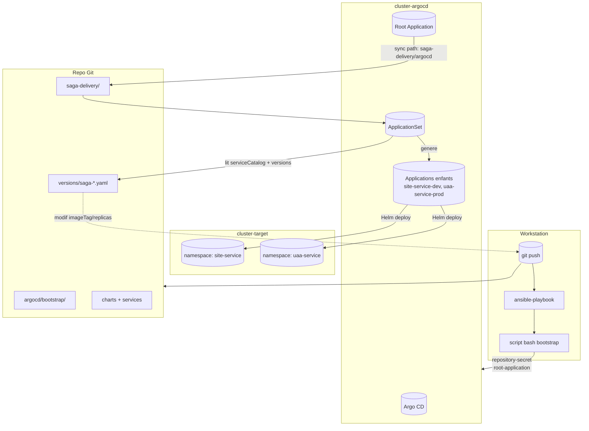
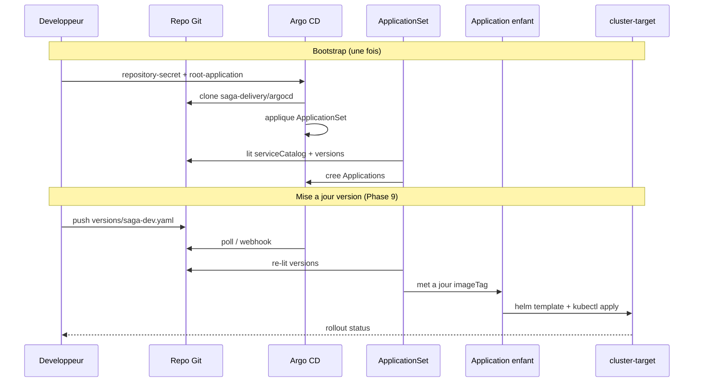

# GitOps Argo CD — Guide d'implementation par phases

Objectif : decrire une implementation GitOps cible pour `site-service`, `uaa-service` et les futurs microservices, avec :

- une instance Argo CD sur un cluster dedie
- un cluster cible distinct pour les services metier
- un bootstrap operationnel hybride :
  - manifests GitOps versionnes dans ce depot
  - automatisation d'initialisation via Ansible + script bash dans un repo infra separe
- un modele Helm factorise avec :
  - `saga-service-lib`
  - `saga-shared-config`
  - un chart par service
- un pilotage GitOps via `serviceCatalog.yaml`, `versions/saga-<env>.yaml` et `ApplicationSet`

Ce document est base sur la regle `/.cursor/rules/argocd-gitops-implementation.mdc`, mais il est organise pour l'execution reelle, phase par phase.
Il decrit aussi la separation de responsabilites entre ce depot applicatif et le repo infra Ansible localise, dans l'environnement courant, sous `/Users/mac/Documents/projet/infomaniak/infra-openstack/ansible`.

---

## Vue d'ensemble

### Clusters concernes

| Nom logique | Role | Exemples d'objets |
|-------------|------|-------------------|
| `cluster-argocd` | heberge l'instance Argo CD | namespace `argocd`, `Application`, `ApplicationSet`, secrets repo, enregistrement du cluster cible |
| `cluster-target` | heberge les microservices | namespaces applicatifs (`site-service`, `uaa-service`, `saga-dev`, `saga-prod`, etc.), `Deployment`, `Service`, `ConfigMap`, `Ingress` |
| `workstation` | poste d'administration | `git`, `kubectl`, `helm`, `argocd`, edition des fichiers |

### Flux cible

```text
workstation
  -> git push sur ce repo
  -> ansible-playbook depuis le repo infra
  -> script bash de bootstrap
  -> kubectl apply / argocd login / argocd cluster add

cluster-argocd
  -> root-application.yaml
  -> applicationset.yaml
  -> genere une Application par service et par environnement

cluster-target
  -> recoit les manifests rendus par Helm
  -> execute site-service, uaa-service, futurs services
```

### Regle de responsabilite

- Argo CD choisit **quel chart** deployer et **avec quelles valeurs**
- Helm rend **le chart principal et ses dependances**
- `saga-service-lib` porte les ressources Kubernetes standard
- `saga-shared-config` porte la ConfigMap des profils techniques partages
- Spring active les profils reels via `SPRING_PROFILES_ACTIVE`

---

## Phase 0 — Prerequis et conventions

### Ou cela s'implemente

- `workstation`
- `cluster-argocd`
- `cluster-target`

### Outils requis

```bash
kubectl version --client
helm version
argocd version --client
git --version
ansible-playbook --version
```

### Variables de travail recommandees

```bash
export REPO_ROOT="$HOME/IdeaProjects/saga-orchestration-case-study"
export ANSIBLE_REPO_ROOT="$HOME/Documents/projet/infomaniak/infra-openstack/ansible"
export ARGOCD_CONTEXT="cluster-argocd-context"
export TARGET_CONTEXT="cluster-target-context"
export ARGOCD_NAMESPACE="argocd"
export GITOPS_REPO_URL="https://github.com/poc-hero/saga-orchestration-case-study.git"
```

### Convention de separation des repos

- ce depot contient les manifests GitOps et les assets consommes par Argo CD :
  - `argocd/bootstrap/*`
  - `saga-delivery/*`
- le repo infra Ansible, localement sous `/Users/mac/Documents/projet/infomaniak/infra-openstack/ansible`, porte :
  - les playbooks
  - les roles
  - les inventories
  - les secrets et variables d'execution
- l'approche recommandee est :
  - Ansible orchestre
  - un script bash execute les commandes `kubectl`, `envsubst` et `argocd`
  - ce depot reste la source de verite des manifests bootstrap et des ressources GitOps

### Verification des contexts Kubernetes

```bash
kubectl config get-contexts
kubectl config use-context "$ARGOCD_CONTEXT"
kubectl cluster-info

kubectl config use-context "$TARGET_CONTEXT"
kubectl cluster-info
```

### Convention de lecture du document

- quand une commande est marquee `cluster-argocd`, elle doit etre executee avec le contexte Kubernetes de l'instance Argo CD
- quand une commande est marquee `cluster-target`, elle doit etre executee avec le contexte Kubernetes du cluster qui heberge les services
- quand une commande est marquee `workstation`, elle agit seulement sur le repo local ou sur Git

---

## Phase 1 — Structurer le repo GitOps

### Ou cela s'implemente

- `workstation`
- Git

### Objectif

Poser la structure cible du dossier `saga-delivery/`.

### Structure cible

```text
saga-delivery/
  charts/
    saga-service-lib/
      Chart.yaml
      templates/
        _helpers.tpl
        _deployment.yaml
        _service.yaml
        _ingress.yaml
        _serviceaccount.yaml
    saga-shared-config/
      Chart.yaml
      files/
        dev/
          application-kafka.yml
          application-mongo.yml
          application-datadog.yml
        prod/
          application-kafka.yml
          application-mongo.yml
          application-datadog.yml
      templates/
        _helpers.tpl
        configmap.yaml
  services/
    site-service/
      Chart.yaml
      values.yaml
      envs/
        dev/
          values.yaml
          configmap-files/
            application.yml
        prod/
          values.yaml
          configmap-files/
            application.yml
      templates/
        configmap.yaml
        resources.yaml
    uaa-service/
      Chart.yaml
      values.yaml
      envs/
        dev/
          values.yaml
          configmap-files/
            application.yml
        prod/
          values.yaml
          configmap-files/
            application.yml
      templates/
        configmap.yaml
        resources.yaml
  serviceCatalog.yaml
  versions/
    saga-dev.yaml
    saga-prod.yaml
  argocd/
    applicationset.yaml
```

### Commentaires importants

- `serviceCatalog.yaml` contient les metadonnees stables : `name`, `repoName`, `chartPath`
- `versions/saga-<env>.yaml` contient les variations d'environnement : `imageTag`, `replicas`, et par service : `cluster` (destination Argo CD), `namespace`, `ingressHost`
- `saga-shared-config` est un **subchart Helm**, pas un simple dossier flottant
- `resources.yaml` du service ne sert qu'a inclure les ressources du `library chart`

### Commandes de verification

```bash
# workstation
cd "$REPO_ROOT"
tree saga-delivery
```

Si `tree` n'est pas disponible :

```bash
cd "$REPO_ROOT"
find saga-delivery -maxdepth 4 -print
```

---

## Phase 2 — Implementer les charts Helm communs

### Ou cela s'implemente

- `workstation`
- rendu Helm local

### Objectif

Mettre en place :

- `charts/saga-service-lib`
- `charts/saga-shared-config`

### 2.1 `saga-service-lib`

Role :

- porter la logique reusable de `Deployment`, `Service`, `Ingress`, `ServiceAccount`
- etre reference comme `library chart`

### 2.2 `saga-shared-config`

Role :

- porter les fichiers techniques partages dans `files/<env>/application-*.yml`
- rendre une ConfigMap partagee par service et par environnement

### Exemple de template `charts/saga-shared-config/templates/configmap.yaml`

```yaml
apiVersion: v1
kind: ConfigMap
metadata:
  name: {{ include "saga-shared-config.fullname" . }}
  labels:
    {{- include "saga-shared-config.labels" . | nindent 4 }}
data:
  {{- $deploymentEnv := .Values.deploymentEnv | default "dev" }}
  {{- range $path, $_ := .Files.Glob (printf "files/%s/application-*.yml" $deploymentEnv) }}
  {{ base $path }}: |
    {{- $.Files.Get $path | nindent 4 }}
  {{- end }}
```

### Commandes de validation locale

```bash
# workstation
cd "$REPO_ROOT/saga-delivery/charts/saga-shared-config"
helm lint .
helm template saga-shared-config . --set deploymentEnv=dev
```

```bash
# workstation
cd "$REPO_ROOT/saga-delivery/charts/saga-service-lib"
helm lint .
```

### Resultat attendu

- `helm template` du chart `saga-shared-config` doit rendre une `ConfigMap`
- elle doit contenir les fichiers de `files/dev/` si `deploymentEnv=dev`

---

## Phase 3 — Implementer les charts service

### Ou cela s'implemente

- `workstation`
- rendu Helm local

### Objectif

Chaque service doit :

- avoir son `application.yml` specifique
- dependre de `saga-service-lib`
- dependre de `saga-shared-config`

### 3.1 Dependencies du chart service

Exemple pour `saga-delivery/services/site-service/Chart.yaml` :

```yaml
dependencies:
  - name: saga-service-lib
    version: 1.0.0
    repository: "file://../../charts/saga-service-lib"
  - name: saga-shared-config
    version: 1.0.0
    repository: "file://../../charts/saga-shared-config"
```

### 3.2 ConfigMap locale du service

Exemple pour `saga-delivery/services/site-service/templates/configmap.yaml` :

```yaml
apiVersion: v1
kind: ConfigMap
metadata:
  name: {{ include "saga-service-lib.fullname" . }}-config
  labels:
    {{- include "saga-service-lib.labels" . | nindent 4 }}
data:
  {{- $deploymentEnv := .Values.deploymentEnv | default "dev" }}
  {{- range $path, $_ := .Files.Glob (printf "envs/%s/configmap-files/**" $deploymentEnv) }}
  {{ base $path }}: |
    {{- $.Files.Get $path | nindent 4 }}
  {{- end }}
  {{- range $key, $val := .Values.env }}
  {{ $key }}: {{ $val | quote }}
  {{- end }}
```

### 3.3 `resources.yaml`

`resources.yaml` du service sert uniquement a inclure les templates du `library chart` :

```yaml
{{ include "saga-service-lib.deployment" . }}
---
{{ include "saga-service-lib.service" . }}
---
{{ include "saga-service-lib.ingress" . }}
---
{{ include "saga-service-lib.serviceaccount" . }}
```

Important :

- `resources.yaml` **n'inclut pas** `saga-shared-config`
- le subchart `saga-shared-config` est rendu automatiquement par Helm parce qu'il est declare dans `dependencies`

### 3.4 Values d'environnement

Priorite des valeurs : `values.yaml` (defauts du chart) puis `envs/<env>/values.yaml` (surcharge), puis parametres Helm passes par Argo CD (`image.tag`, `replicaCount`, `ingress.host`, etc.). Les `replicas` et tags d'image restent la source de verite dans `versions/` ; les fichiers `envs/` portent surtout `env` (Spring, logs) et des surcharges comme `resources` (dev plus leger, prod plus eleve).

Exemple `saga-delivery/services/site-service/envs/dev/values.yaml` :

```yaml
env:
  SPRING_PROFILES_ACTIVE: "dev,mongo,datadog"
  JAVA_TOOL_OPTIONS: "-XX:MaxRAMPercentage=75.0"
  SITE_SERVICES_UAA_URL: "http://uaa-service:8080"
  LOG_LEVEL: "DEBUG"

resources:
  requests:
    cpu: 50m
    memory: 128Mi
  limits:
    cpu: 500m
    memory: 512Mi
```

`deploymentEnv` et `saga-shared-config.deploymentEnv` ne sont pas dupliques ici : l'`ApplicationSet` les injecte via des parametres Helm (`{{ .env }}`). Pour un `helm template` local sur ce chart, passer explicitement :

```bash
--set deploymentEnv=dev --set saga-shared-config.deploymentEnv=dev
```

### 3.5 Commandes de validation locale

```bash
# workstation
cd "$REPO_ROOT/saga-delivery/services/site-service"
helm dependency update
helm lint .
helm template site-service . -f values.yaml -f envs/dev/values.yaml \
  --set deploymentEnv=dev --set saga-shared-config.deploymentEnv=dev
```

```bash
# workstation
cd "$REPO_ROOT/saga-delivery/services/uaa-service"
helm dependency update
helm lint .
helm template uaa-service . -f values.yaml -f envs/dev/values.yaml \
  --set deploymentEnv=dev --set saga-shared-config.deploymentEnv=dev
```

### Resultat attendu

Le rendu Helm d'un service doit contenir :

- la `ConfigMap` locale du service
- la `ConfigMap` partagee du subchart `saga-shared-config`
- le `Deployment`
- le `Service`
- l'`Ingress`
- le `ServiceAccount`

---

## Phase 4 — Implementer le catalogue et les versions

### Ou cela s'implemente

- `workstation`
- Git

### Objectif

Separer :

- les metadonnees stables
- les variations d'environnement

### 4.1 `serviceCatalog.yaml`

Exemple :

```yaml
services:
  - name: site-service
    repoName: saga-orchestration-case-study
    chartPath: services/site-service
  - name: uaa-service
    repoName: saga-orchestration-case-study
    chartPath: services/uaa-service
```

### 4.2 `versions/saga-dev.yaml`

Chaque service declare aussi **ou** il deploye (cluster Argo CD enregistre, namespace K8s) et **quel host** Ingress utiliser. Cela evite le conflit dev/prod sur le meme namespace.

Exemple :

```yaml
env: dev
services:
  - name: site-service
    imageTag: "3.0.1.mongo"
    replicas: "1"
    cluster: cluster-target
    namespace: site-service-dev
    ingressHost: site-service.dev.saga-k8s.local
  - name: uaa-service
    imageTag: "1.0.0"
    replicas: "1"
    cluster: cluster-target
    namespace: uaa-service-dev
    ingressHost: uaa-service.dev.saga-k8s.local
```

| Champ | Role |
|--------|------|
| `cluster` | `spec.destination.name` de l'Application — doit correspondre a un cluster enregistre dans Argo CD (`argocd cluster add ... --name ...`) |
| `namespace` | Namespace Kubernetes cible (distinct par env si besoin) |
| `ingressHost` | Passe en parametre Helm `ingress.host` pour le chart service |

### 4.3 `versions/saga-prod.yaml`

Meme structure ; tu peux utiliser un **autre** `cluster` pour la prod (ex. `cluster-target-prod`) si l'infra le prevoit.

```yaml
env: prod
services:
  - name: site-service
    imageTag: "3.0.5"
    replicas: "2"
    cluster: cluster-target
    namespace: site-service-prod
    ingressHost: site-service.prod.saga-k8s.local
  - name: uaa-service
    imageTag: "1.0.3"
    replicas: "2"
    cluster: cluster-target
    namespace: uaa-service-prod
    ingressHost: uaa-service.prod.saga-k8s.local
```

### Commandes de validation

```bash
# workstation
cd "$REPO_ROOT"
yq '.' saga-delivery/serviceCatalog.yaml
yq '.' saga-delivery/versions/saga-dev.yaml
yq '.' saga-delivery/versions/saga-prod.yaml
```

Si `yq` n'est pas disponible :

```bash
python3 -c 'import yaml,sys; print(yaml.safe_load(open("saga-delivery/serviceCatalog.yaml")))' 
python3 -c 'import yaml,sys; print(yaml.safe_load(open("saga-delivery/versions/saga-dev.yaml")))' 
python3 -c 'import yaml,sys; print(yaml.safe_load(open("saga-delivery/versions/saga-prod.yaml")))' 
```

---

## Phase 5 — Implementer l'ApplicationSet

### Ou cela s'implemente

- `workstation`
- Git
- rendu Argo CD sur `cluster-argocd`

### Objectif

L'`ApplicationSet` doit :

- lire `serviceCatalog.yaml`
- lire `versions/saga-*.yaml`
- fusionner les services par `name` **et** `env` (merge generator ; sans `env` dans les cles, erreur *Duplicate key* sur `name` quand dev et prod declarent le meme service)
- generer une `Application` par service et par environnement

### Exemple d'`applicationset.yaml`

```yaml
apiVersion: argoproj.io/v1alpha1
kind: ApplicationSet
metadata:
  name: saga
  namespace: argocd
spec:
  goTemplate: true
  goTemplateOptions: ["missingkey=error"]
  generators:
    - merge:
        mergeKeys:
          - name
          - env
        generators:
          - matrix:
              generators:
                - git:
                    repoURL: https://github.com/poc-hero/saga-orchestration-case-study.git
                    revision: HEAD
                    files:
                      - path: saga-delivery/serviceCatalog.yaml
                - list:
                    elementsYaml: |
                      {{- $items := list }}
                      {{- range .services }}
                      {{- $service := . }}
                      {{- range $env := list "dev" "prod" }}
                      {{- $items = append $items (merge $service (dict "env" $env)) }}
                      {{- end }}
                      {{- end }}
                      {{ $items | toJson }}
          - matrix:
              generators:
                - git:
                    repoURL: https://github.com/poc-hero/saga-orchestration-case-study.git
                    revision: HEAD
                    files:
                      - path: saga-delivery/versions/saga-*.yaml
                - list:
                    elementsYaml: |
                      {{- $env := .env -}}
                      {{- $items := list -}}
                      {{- range .services }}
                      {{- $items = append $items (merge . (dict "env" $env)) -}}
                      {{- end }}
                      {{ $items | toJson }}
  template:
    metadata:
      name: "{{ .name }}-{{ .env }}"
    spec:
      project: default
      source:
        repoURL: "{{ printf \"https://github.com/poc-hero/%s.git\" .repoName }}"
        targetRevision: HEAD
        path: "{{ .chartPath }}"
        helm:
          valueFiles:
            - values.yaml
            - envs/{{ .env }}/values.yaml
          parameters:
            - name: deploymentEnv
              value: "{{ .env }}"
            - name: saga-shared-config.deploymentEnv
              value: "{{ .env }}"
            - name: image.tag
              value: "{{ .imageTag }}"
            - name: replicaCount
              value: "{{ .replicas }}"
            - name: ingress.host
              value: "{{ .ingressHost }}"
      destination:
        name: "{{ .cluster }}"
        namespace: "{{ .namespace }}"
      syncPolicy:
        automated:
          prune: true
          selfHeal: true
```

### Commandes de verification (Phase 5 uniquement)

A ce stade, l'ApplicationSet n'existe que dans Git ; il n'est pas encore applique sur le cluster.
Seules les verifications locales sont possibles :

```bash
# workstation
cd "$REPO_ROOT"

# Verifier la presence des elements cles dans applicationset.yaml
rg "path: \"versions/saga-\\*\\.yaml\"|serviceCatalog.yaml|mergeKeys" "saga-delivery/argocd/applicationset.yaml"

# Verifier que les fichiers lus par l'ApplicationSet existent
ls saga-delivery/serviceCatalog.yaml saga-delivery/versions/saga-dev.yaml saga-delivery/versions/saga-prod.yaml
```

Les verifications cote cluster (ApplicationSet et Applications deployees) se font en **Phase 8**, apres le bootstrap (Phases 6-7). Voir la section 8.1.

---

## Phase 6 — Bootstrap de l'instance Argo CD

### Ou cela s'implemente

- `cluster-argocd`

### Objectif

Donner a Argo CD :

- acces au repo Git
- une application racine vers `saga-delivery/argocd`

### Approche recommandee

Le bootstrap n'est pas pilote manuellement commande par commande depuis ce repo.
L'approche cible retenue est hybride :

- les manifests de bootstrap restent versionnes ici :
  - `argocd/bootstrap/repository-secret.yaml.template`
  - `argocd/bootstrap/root-application.yaml`
- le playbook Ansible vit dans le repo infra externe :
  - `/Users/mac/Documents/projet/infomaniak/infra-openstack/ansible`
- le playbook appelle un script bash qui :
  - injecte les variables
  - applique les manifests sur `cluster-argocd`
  - prepare la connexion Argo CD pour la suite du bootstrap

En pratique, ce depot documente les entrees du bootstrap ; l'execution automatisee se fait depuis le repo infra.

### Sequence logique du bootstrap

La phase 6 doit etre lue dans cet ordre :

1. enregistrer le repo Git dans Argo CD via `repository-secret.yaml.template`
2. creer la Root Application via `root-application.yaml`
3. laisser Argo CD synchroniser `saga-delivery/argocd`
4. laisser le controleur `ApplicationSet` decouvrir `applicationset.yaml` et generer les Applications enfants

Autrement dit :

- en phase 5, `applicationset.yaml` existe seulement dans Git
- en phase 6, la Root Application indique a Argo CD ou aller le chercher
- apres synchronisation, l'`ApplicationSet` devient une ressource du cluster Argo CD
- seulement ensuite Argo CD peut generer les Applications `site-service-dev`, `uaa-service-dev`, etc.

### Variables attendues par le bootstrap automatise

Le playbook peut centraliser, entre autres :

- `REPO_ROOT` : chemin local de ce repo
- `ARGOCD_CONTEXT` : contexte Kubernetes du cluster Argo CD
- `ARGOCD_NAMESPACE` : namespace Argo CD
- `GIT_TOKEN` : token d'acces au repo Git
- `ARGOCD_SERVER` : URL Argo CD
- `ARGOCD_ADMIN_TOKEN` : token de login Argo CD
- `TARGET_CONTEXT` : contexte Kubernetes du cluster cible

### Exemple d'orchestration depuis le repo infra

Commande de haut niveau :

```bash
# workstation, repo infra Ansible
cd "$ANSIBLE_REPO_ROOT"
ansible-playbook playbooks/argocd-bootstrap.yml \
  -e "repo_root=$REPO_ROOT" \
  -e "argocd_context=$ARGOCD_CONTEXT" \
  -e "argocd_namespace=$ARGOCD_NAMESPACE" \
  -e "target_context=$TARGET_CONTEXT"
```

Le playbook appelle ensuite un script bash du type :

```bash
#!/usr/bin/env bash
set -euo pipefail

envsubst < "$REPO_ROOT/argocd/bootstrap/repository-secret.yaml.template" | \
  kubectl --context "$ARGOCD_CONTEXT" apply -n "$ARGOCD_NAMESPACE" -f -

kubectl --context "$ARGOCD_CONTEXT" apply \
  -f "$REPO_ROOT/argocd/bootstrap/root-application.yaml"
```

### 6.1 Enregistrer le repo Git dans Argo CD

Fichier concerne :

- `argocd/bootstrap/repository-secret.yaml.template`

Commande de reference (utile pour debug ou reproduction manuelle) :

```bash
# cluster-argocd
kubectl config use-context "$ARGOCD_CONTEXT"

export GIT_TOKEN="<token-github>"
envsubst < "$REPO_ROOT/argocd/bootstrap/repository-secret.yaml.template" | \
  kubectl apply -n "$ARGOCD_NAMESPACE" -f -
```

Verification :

```bash
kubectl --context "$ARGOCD_CONTEXT" -n "$ARGOCD_NAMESPACE" get secret
kubectl --context "$ARGOCD_CONTEXT" -n "$ARGOCD_NAMESPACE" get secret -l argocd.argoproj.io/secret-type=repository
```

### 6.1a Repos Git multiples : orchestration vs `serviceCatalog`

Le secret `argocd/bootstrap/repository-secret.yaml.template` enregistre **un seul** depot Git (celui de ce repo, utilise par la Root Application et par les generateurs `git` de l'`ApplicationSet` pour lire `serviceCatalog.yaml` et `versions/`).

Les `Application` generees ont une `source.repoURL` construite a partir de `repoName` dans `saga-delivery/serviceCatalog.yaml` (voir `applicationset.yaml`, champ `spec.template.spec.source.repoURL`). Des que ce depot **differe** de l'URL du repo orchestration, ou des qu'un depot applicatif est **prive**, Argo CD doit pouvoir **cloner chaque URL** utilisee : les identifiants ne se mettent **pas** dans `serviceCatalog`, ils se declarent **cote Argo CD**, par URL (ou par prefixe d'URL avec un credential template).

**Principe :**

- Chaque URL Git (ou prefixe couvert par un credential template) referencee par une `Application` doit etre **connue** d'Argo CD avec les bons droits si le depot est prive.
- Un **premier** `Secret` avec `argocd.argoproj.io/secret-type: repository` suffit pour le repo GitOps ; pour **chaque autre** depot prive, ajouter **un autre** `Secret` (ou une autre methode : SSH, credential template, etc.).

**Exemple : secret supplementaire pour un depot applicatif prive** (HTTPS + PAT) :

```yaml
apiVersion: v1
kind: Secret
metadata:
  name: mon-chart-repo-prive
  namespace: argocd
  labels:
    argocd.argoproj.io/secret-type: repository
stringData:
  type: git
  url: https://github.com/mon-org/mon-autre-repo.git
  username: git
  password: "<PAT avec acces a ce depot (ou a l'org)>"
```

En pratique : variables d'environnement distinctes (`GIT_TOKEN_ORCHESTRATION`, `GIT_TOKEN_APPS`, etc.) et un `envsubst` par template, ou secrets injectes par Ansible / vault — **sans** committer les tokens dans Git.

Si un **seul** PAT GitHub couvre plusieurs depots sous le meme compte ou organisation, on peut souvent reutiliser le meme mot de passe, mais Argo CD doit quand meme **associer** chaque URL (ou un prefixe URL via [credential templates](https://argo-cd.readthedocs.io/en/stable/operator-manual/declarative-setup/#repositories)) aux credentials. Pour SSH, utiliser les secrets / cles prevus par la documentation Argo CD pour les depots.

### 6.2 Creer la root application

Fichier concerne :

- `argocd/bootstrap/root-application.yaml`

Commande de reference (utile pour debug ou reproduction manuelle) :

```bash
# cluster-argocd
kubectl --context "$ARGOCD_CONTEXT" apply -f "$REPO_ROOT/argocd/bootstrap/root-application.yaml"
```

Verification :

```bash
kubectl --context "$ARGOCD_CONTEXT" -n "$ARGOCD_NAMESPACE" get application saga-delivery-root
kubectl --context "$ARGOCD_CONTEXT" -n "$ARGOCD_NAMESPACE" describe application saga-delivery-root
```

Option CLI Argo CD :

```bash
argocd login <argocd-server>
argocd app get saga-delivery-root
argocd app sync saga-delivery-root
```

### 6.3 Decouverte de l'`ApplicationSet` par Argo CD

L'`ApplicationSet` n'est pas deja connu d'Argo CD avant la phase 6.
C'est la Root Application qui l'installe.

Extrait representatif de `root-application.yaml` :

```yaml
spec:
  source:
    repoURL: https://github.com/poc-hero/saga-orchestration-case-study.git
    path: saga-delivery/argocd
    targetRevision: HEAD
```

Quand Argo CD synchronise cette Application :

- il clone le repo Git grace au `repository-secret`
- il lit le contenu du dossier `saga-delivery/argocd`
- il applique sur **`cluster-argocd`** les manifests trouves dans ce chemin

L'ApplicationSet est une ressource custom Argo CD ; elle doit vivre sur le cluster où Argo CD tourne (`cluster-argocd`).
Les manifests applicatifs (Deployment, Service, ConfigMap, etc.) iront eux vers `cluster-target` via les Applications enfants generees.

Parmi les manifests appliques sur `cluster-argocd`, il y a `applicationset.yaml`.

Une fois l'`ApplicationSet` creee comme ressource Kubernetes, le controleur `ApplicationSet` d'Argo CD :

- detecte la nouvelle ressource
- execute les generators
- cree les Applications enfants (ex. `site-service-dev`, `uaa-service-prod`)

Chaque Application enfant a `destination.name: cluster-target` et `destination.namespace: <service>`.
Lors de leur sync, ce sont elles qui appliquent les manifests applicatifs sur `cluster-target`.

Cela explique pourquoi les verifications suivantes ne sont valides qu'apres le bootstrap complet :

```bash
kubectl --context "$ARGOCD_CONTEXT" -n "$ARGOCD_NAMESPACE" get applicationsets.argoproj.io
kubectl --context "$ARGOCD_CONTEXT" -n "$ARGOCD_NAMESPACE" get applications.argoproj.io
```

---

## Phase 7 — Enregistrer le cluster cible dans Argo CD

### Ou cela s'implemente

- `cluster-argocd`
- `workstation`

### Objectif

Permettre aux `Application` generees de deployer vers `cluster-target`.

### Approche recommandee

Comme pour la phase 6, l'enregistrement du cluster cible doit etre orchestre par le repo infra Ansible, pas execute manuellement a chaque fois depuis ce depot.

Modele retenu :

- Ansible fournit les variables et secrets
- le script bash effectue le `argocd login`
- le script bash lance `argocd cluster add "$TARGET_CONTEXT" --name cluster-target`

Exemple de logique dans le script appele par Ansible :

```bash
argocd login "$ARGOCD_SERVER" --auth-token "$ARGOCD_ADMIN_TOKEN" --grpc-web
argocd cluster add "$TARGET_CONTEXT" --name cluster-target --yes
```

Le nom logique `cluster-target` doit rester stable, car il est reference dans `spec.destination.name` de l'`ApplicationSet`.

### Option de reference avec CLI Argo CD

```bash
# workstation
argocd login <argocd-server>
argocd cluster add "$TARGET_CONTEXT" --name cluster-target
```

### Verification

```bash
argocd cluster list
kubectl --context "$ARGOCD_CONTEXT" -n "$ARGOCD_NAMESPACE" get secrets
```

### Resultat attendu

Le cluster cible apparait dans Argo CD avec un nom stable, par exemple :

- `cluster-target`

Ce nom doit correspondre a `destination.name` dans l'`ApplicationSet`.

---

## Phase 8 — Deployer et verifier

### Ou cela s'implemente

- `cluster-argocd`
- `cluster-target`

### 8.1 Verification cote Argo CD

Verification de l'ApplicationSet (Phase 5) et des Applications generees — executable uniquement apres le bootstrap (Phases 6-7) :

```bash
# cluster-argocd
kubectl --context "$ARGOCD_CONTEXT" -n "$ARGOCD_NAMESPACE" get applicationsets.argoproj.io
kubectl --context "$ARGOCD_CONTEXT" -n "$ARGOCD_NAMESPACE" get applications.argoproj.io
```

Avec la CLI :

```bash
argocd app list
argocd app get site-service-dev
argocd app get uaa-service-dev
```

### 8.2 Verification cote cluster cible

```bash
# cluster-target
kubectl --context "$TARGET_CONTEXT" get ns
kubectl --context "$TARGET_CONTEXT" get deploy,svc,cm,ing -A
kubectl --context "$TARGET_CONTEXT" get configmap -n site-service
kubectl --context "$TARGET_CONTEXT" get configmap -n uaa-service
```

### 8.3 Verification des ConfigMaps

Service :

```bash
kubectl --context "$TARGET_CONTEXT" -n site-service get configmap
kubectl --context "$TARGET_CONTEXT" -n site-service get configmap <site-service-configmap> -o yaml
```

Shared config :

```bash
kubectl --context "$TARGET_CONTEXT" -n site-service get configmap | rg "shared|config"
kubectl --context "$TARGET_CONTEXT" -n site-service get configmap <shared-config-configmap> -o yaml
```

### 8.4 Verification des pods

```bash
kubectl --context "$TARGET_CONTEXT" -n site-service get pods
kubectl --context "$TARGET_CONTEXT" -n site-service logs deploy/site-service

kubectl --context "$TARGET_CONTEXT" -n uaa-service get pods
kubectl --context "$TARGET_CONTEXT" -n uaa-service logs deploy/uaa-service
```

---

## Phase 9 — Changer une version ou ajouter un profil partage

### Ou cela s'implemente

- `workstation`
- Git
- propagation automatique vers `cluster-argocd` puis `cluster-target`

### 9.1 Changer une version de service

Fichier a modifier :

- `saga-delivery/versions/saga-<env>.yaml`

Exemple :

```yaml
env: dev
services:
  - name: site-service
    imageTag: "3.0.2"
    replicas: "1"
```

Commandes :

```bash
# workstation
cd "$REPO_ROOT"
git add saga-delivery/versions/saga-dev.yaml
git commit -m "update site-service dev image tag"
git push
```

Verification :

```bash
# cluster-argocd
argocd app get site-service-dev

# cluster-target
kubectl --context "$TARGET_CONTEXT" -n site-service rollout status deploy/site-service
```

### 9.2 Ajouter un profil technique partage

Fichier a ajouter :

- `saga-delivery/charts/saga-shared-config/files/<env>/application-<profile>.yml`

Exemple :

```text
saga-delivery/charts/saga-shared-config/files/dev/application-rabbit.yml
```

Commandes :

```bash
# workstation
cd "$REPO_ROOT"
git add saga-delivery/charts/saga-shared-config/files/dev/application-rabbit.yml
git commit -m "add shared rabbit profile for dev"
git push
```

Puis activer le profil dans le service concerne :

```yaml
deploymentEnv: dev
env:
  SPRING_PROFILES_ACTIVE: "dev,mongo,datadog,rabbit"
```

Verification :

```bash
# workstation
cd "$REPO_ROOT/saga-delivery/services/site-service"
helm template site-service . -f values.yaml -f envs/dev/values.yaml
```

Puis :

```bash
# cluster-target
kubectl --context "$TARGET_CONTEXT" -n site-service get configmap <shared-config-configmap> -o yaml
kubectl --context "$TARGET_CONTEXT" -n site-service logs deploy/site-service
```

---

## Phase 10 — Rollback et operations courantes

### Ou cela s'implemente

- `cluster-argocd`
- `cluster-target`
- Git

### Rollback GitOps

La methode standard est de revenir a un commit precedent dans Git :

```bash
# workstation
git log --oneline
git revert <commit_sha>
git push
```

### Verification du resync

```bash
# cluster-argocd
argocd app history site-service-dev
argocd app get site-service-dev
```

### Observation cote cluster cible

```bash
kubectl --context "$TARGET_CONTEXT" -n site-service rollout status deploy/site-service
kubectl --context "$TARGET_CONTEXT" -n site-service describe deploy/site-service
```

---

## Resume des responsabilites

| Element | Implante dans | Role |
|--------|----------------|------|
| `argocd/bootstrap/repository-secret.yaml.template` | `cluster-argocd` | donne l'acces Git au **repo orchestration** ; un secret supplementaire par URL si les charts sont dans d'autres depots prives (`serviceCatalog` / `repoURL`) |
| `argocd/bootstrap/root-application.yaml` | `cluster-argocd` | connecte Argo CD au dossier `saga-delivery/argocd` |
| repo infra Ansible (`/Users/mac/Documents/projet/infomaniak/infra-openstack/ansible`) | infrastructure externe | orchestre le bootstrap et centralise les variables |
| script bash appele par Ansible | workstation / automation runner | execute `envsubst`, `kubectl apply`, `argocd login`, `argocd cluster add` |
| `saga-delivery/argocd/applicationset.yaml` | Git, rendu sur `cluster-argocd` | genere les `Application` |
| `saga-delivery/serviceCatalog.yaml` | Git | metadonnees stables par service |
| `saga-delivery/versions/saga-<env>.yaml` | Git | variations par environnement |
| `saga-delivery/charts/saga-service-lib` | Helm | ressources Kubernetes standard |
| `saga-delivery/charts/saga-shared-config` | Helm | ConfigMap des profils techniques partages |
| `saga-delivery/services/<service>` | Helm | chart principal de chaque service |
| `cluster-target` | Kubernetes | execution des services |

---

## Commandes de reference

### Ansible

```bash
cd "$ANSIBLE_REPO_ROOT"
ansible-playbook playbooks/argocd-bootstrap.yml \
  -e "repo_root=$REPO_ROOT" \
  -e "argocd_context=$ARGOCD_CONTEXT" \
  -e "argocd_namespace=$ARGOCD_NAMESPACE" \
  -e "target_context=$TARGET_CONTEXT"
```

### Git

```bash
cd "$REPO_ROOT"
git status
git add .
git commit -m "update gitops delivery"
git push
```

### Helm

```bash
cd "$REPO_ROOT/saga-delivery/services/site-service"
helm dependency update
helm lint .
helm template site-service . -f values.yaml -f envs/dev/values.yaml
```

### Argo CD

```bash
argocd login <argocd-server>
argocd cluster list
argocd app list
argocd app get saga-delivery-root
argocd app get site-service-dev
argocd app sync saga-delivery-root
```

### Kubernetes — cluster Argo CD

```bash
kubectl --context "$ARGOCD_CONTEXT" -n "$ARGOCD_NAMESPACE" get applications
kubectl --context "$ARGOCD_CONTEXT" -n "$ARGOCD_NAMESPACE" get applicationsets
kubectl --context "$ARGOCD_CONTEXT" -n "$ARGOCD_NAMESPACE" get secret
```

### Kubernetes — cluster cible

```bash
kubectl --context "$TARGET_CONTEXT" get ns
kubectl --context "$TARGET_CONTEXT" get deploy,svc,cm,ing -A
kubectl --context "$TARGET_CONTEXT" -n site-service logs deploy/site-service
kubectl --context "$TARGET_CONTEXT" -n uaa-service logs deploy/uaa-service
```

---

## Decision d'architecture retenue

La configuration commune n'est pas montee :

- ni par `templates/resources.yaml`
- ni par l'`ApplicationSet`

Elle est rendue automatiquement par Helm via la dependance `saga-shared-config` declaree dans `Chart.yaml` du service.

En resume :

1. `ApplicationSet` choisit le chart et les valeurs
2. Helm rend le chart service
3. Helm rend aussi ses dependances :
   - `saga-service-lib`
   - `saga-shared-config`
4. `cluster-target` recoit :
   - la ConfigMap locale du service
   - la ConfigMap partagee
   - les ressources Kubernetes standard

---

## Prochaine etape recommandee

Commencer par un service pilote :

1. implementer `saga-shared-config`
2. brancher `site-service` dessus
3. valider le rendu Helm local
4. valider le deploiement Argo CD sur `dev`
5. generaliser ensuite a `uaa-service`

---

## Annexes — Diagrammes de flux

### Flux global (Bootstrap + GitOps)



### Sequence : mise a jour d'une version (Phase 9)


