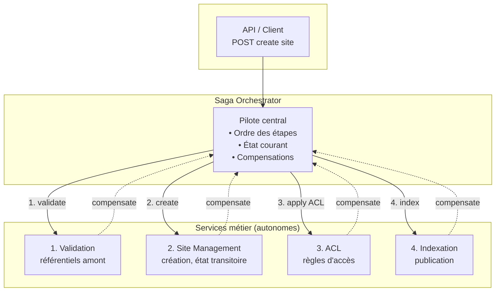

# Schéma d'infrastructure – Saga Orchestration (création de site client)

Basé sur le plan : orchestrateur central, 4 étapes, compensations en ordre inverse.

---

## Vue d'ensemble

```
                    ┌─────────────────────────────────────────────────────────────────┐
                    │                        CLIENT / API                              │
                    │              POST /api/site/create (companyId, siteName)         │
                    └────────────────────────────────┬────────────────────────────────┘
                                                      │
                                                      ▼
┌─────────────────────────────────────────────────────────────────────────────────────────────────────────────┐
│                              SAGA ORCHESTRATOR                                                                │
│  • Enchaîne les étapes dans l’ordre                                                                          │
│  • Suit l’état courant de la Saga                                                                             │
│  • En cas d’échec : déclenche les compensations en ordre inverse                                             │
│  • Ne porte pas les données métier ; pilote uniquement le workflow                                            │
└───┬─────────────────────────┬─────────────────────────┬─────────────────────────┬─────────────────────────┘
    │                         │                         │                         │
    │ 1. Validation           │ 2. Création site         │ 3. ACL                   │ 4. Indexation
    │    référentiels         │    (état transitoire)   │    (règles d’accès)      │    (publication)
    ▼                         ▼                         ▼                         ▼
┌───────────────┐       ┌───────────────┐       ┌───────────────┐       ┌───────────────┐
│  SERVICE      │       │  SERVICE      │       │  SERVICE      │       │  SERVICE      │
│  Validation   │       │  Site         │       │  ACL          │       │  Indexation   │
│  (référentiels│       │  Management   │       │               │       │               │
│   amont)      │       │               │       │               │       │               │
├───────────────┤       ├───────────────┤       ├───────────────┤       ├───────────────┤
│ • Entreprise  │       │ • Création    │       │ • Qui peut    │       │ • Rendu       │
│ • Partenaires │       │   entité site  │       │   voir /      │       │   visible     │
│   humains     │       │ • État        │       │   administrer │       │   (recherche,  │
│               │       │   transitoire │       │               │       │   navigation)  │
├───────────────┤       ├───────────────┤       ├───────────────┤       ├───────────────┤
│ [Référentiel] │       │ [Référentiel] │       │ [Référentiel] │       │ [Référentiel] │
│ ou DB locale  │       │ ou DB locale  │       │ ou DB locale  │       │ ou DB locale  │
└───────────────┘       └───────────────┘       └───────────────┘       └───────────────┘
```

---

## Flux nominal (succès)

```
Client          Orchestrator      Validation      Site            ACL             Indexation
  │                    │                │            │              │                  │
  │  create site       │                │            │              │                  │
  │───────────────────►│                │            │              │                  │
  │                    │  validate      │            │              │                  │
  │                    │───────────────►│            │              │                  │
  │                    │  OK (refs)    │            │              │                  │
  │                    │◄──────────────│            │              │                  │
  │                    │  create       │            │              │                  │
  │                    │───────────────────────────►│              │                  │
  │                    │  OK (siteId)  │            │              │                  │
  │                    │◄──────────────────────────│              │                  │
  │                    │  apply ACL    │            │              │                  │
  │                    │──────────────────────────────────────────►│                  │
  │                    │  OK           │            │              │                  │
  │                    │◄──────────────────────────────────────────│                  │
  │                    │  index        │            │              │                  │
  │                    │─────────────────────────────────────────────────────────────►│
  │                    │  OK           │            │              │                  │
  │                    │◄─────────────────────────────────────────────────────────────│
  │  200               │                │            │              │                  │
  │◄───────────────────│                │            │              │                  │
```

---

## Flux avec échec et compensations

```
Client          Orchestrator      Validation      Site            ACL             Indexation
  │                    │                │            │              │                  │
  │  create site       │                │            │              │                  │
  │───────────────────►│                │            │              │                  │
  │                    │  validate      │            │              │                  │
  │                    │───────────────►│            │              │                  │
  │                    │  OK            │            │              │                  │
  │                    │◄───────────────│            │              │                  │
  │                    │  create        │            │              │                  │
  │                    │───────────────────────────►│              │                  │
  │                    │  OK            │            │              │                  │
  │                    │◄──────────────────────────│              │                  │
  │                    │  apply ACL     │            │              │                  │
  │                    │──────────────────────────────────────────►│                  │
  │                    │  OK            │            │              │                  │
  │                    │◄──────────────────────────────────────────│                  │
  │                    │  index         │            │              │                  │
  │                    │─────────────────────────────────────────────────────────────►│
  │                    │  FAIL          │            │              │                  │
  │                    │◄─────────────────────────────────────────────────────────────│
  │                    │  compensate ACL│            │              │                  │
  │                    │──────────────────────────────────────────►│                  │
  │                    │  compensate    │            │              │                  │
  │                    │  site         │            │              │                  │
  │                    │───────────────────────────►│              │                  │
  │                    │  compensate   │            │              │                  │
  │                    │  validation    │            │              │                  │
  │                    │───────────────►│            │              │                  │
  │  5xx / error       │                │            │              │                  │
  │◄───────────────────│                │            │              │                  │
```

---

## Mermaid (pour rendu dans GitHub / outil)



---

## Invariant métier (rappel)

| État | Signification |
|------|----------------|
| **Site valide** | Gouverné + sécurisé + publiable (les 4 étapes ont réussi). |
| **Site invalide / inexistant** | Dès qu’une étape échoue, la Saga compense : soit le site est pleinement valide, soit il n’existe pas. |

L’orchestrateur ne détient pas les données ; il assure la **cohérence métier globale** en pilotant les étapes et les compensations.
